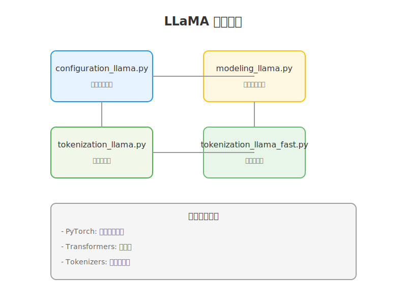
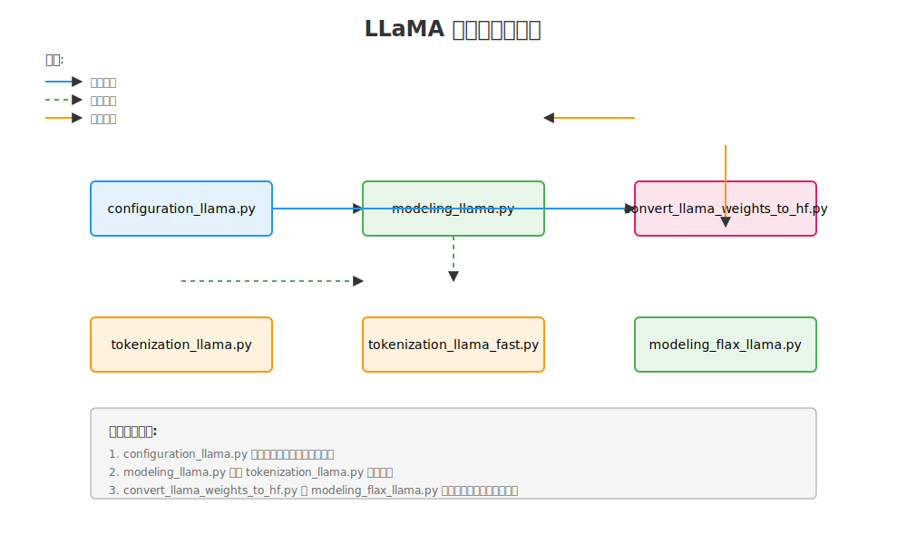

# LLaMA Model Documentation

## 目录
- [1. 代码库概述](#1-代码库概述)
- [2. 运行说明](#2-运行说明)
- [3. 依赖库分析](#3-依赖库分析)

## 1. 代码库概述

LLaMA模型在Hugging Face transformers库中的实现包含了完整的模型架构、配置和分词功能。代码库采用模块化设计，将不同功能清晰地分离到不同文件中。

### 主要组件：

1. **配置模块** (configuration_llama.py)
   - 定义模型的核心参数
   - 处理配置的序列化和反序列化

2. **模型模块** (modeling_llama.py)
   - 实现核心模型架构
   - 包含注意力机制和前馈网络

3. **分词器模块** (tokenization_llama.py)
   - 实现基本的分词功能
   - 处理文本的编码和解码

4. **快速分词器** (tokenization_llama_fast.py)
   - 提供性能优化的分词实现
   - 使用Rust实现的tokenizers库
### 结构


## 2. 运行说明

### 安装依赖
```bash
pip install torch
pip install transformers
pip install tokenizers
```

### 基本使用示例
```python
from transformers import LlamaConfig, LlamaModel, LlamaTokenizer

# 加载配置
config = LlamaConfig.from_pretrained("meta-llama/Llama-2-7b")

# 初始化模型
model = LlamaModel.from_pretrained("meta-llama/Llama-2-7b")

# 加载分词器
tokenizer = LlamaTokenizer.from_pretrained("meta-llama/Llama-2-7b")

# 处理文本
text = "Hello, I am LLaMA!"
inputs = tokenizer(text, return_tensors="pt")
outputs = model(**inputs)
```

## 3. 依赖库分析

### 核心依赖

1. **PyTorch**
   - 版本要求: >=1.10.0
   - 作用: 深度学习框架，提供张量运算和自动求导功能
   - 主要用于: 模型的前向传播和反向传播

2. **Transformers**
   - 版本要求: >=4.27.0
   - 作用: 提供基础的模型接口和工具
   - 主要用于: 模型的加载、保存和推理

3. **Tokenizers**
   - 版本要求: >=0.13.0
   - 作用: 提供高性能的分词实现
   - 主要用于: 快速分词器的底层实现

### 可选依赖

1. **Accelerate**
   - 作用: 提供模型加速和分布式训练支持
   - 主要用于: 大规模模型的训练和推理

2. **SentencePiece**
   - 作用: 提供BPE分词算法支持
   - 主要用于: 分词器的训练和词典构建

## 4. 核心文件分析
- [4.1 configuration_llama.py](configuration-llama.md)
- [4.2 modeling-llama.py](modeling-llama.md)
- [4.3 tokenization-llama.py](tokenization-llama.md)
- [4.4 modeling-flax-llama.py](modeling-flax-llama.md)
- [4.5 convert-weights.py](convert-weights.md)
## 5.文件依赖关系

### LLaMA 文件依赖关系说明

#### 依赖类型

##### 1. 配置依赖（蓝色实线箭头）
- **configuration_llama.py** 作为核心配置文件，被其他所有模块引用
- 提供以下配置信息：
   - 模型结构参数
   - 训练参数
   - 基础配置信息

#####  2. 调用关系（绿色虚线箭头）
- **modeling_llama.py** 调用 **tokenization_llama.py** 进行文本处理
- **tokenization_llama_fast.py** 继承和扩展基础分词器功能
   - 提供更高效的分词实现
   - 保持与基础分词器的接口一致

#####  3. 权重转换关系（橙色实线箭头）
- **convert_llama_weights_to_hf.py** 与其他文件的交互：
   - 与 **modeling_llama.py** 之间的权重转换
   - 为 **modeling_flax_llama.py** 提供权重转换支持

#### 文件分类

#####  1. 配置文件（蓝色框）
- **configuration_llama.py**
   - 核心配置定义
   - 参数管理
   - 配置序列化

#####  2. 模型实现（绿色框）
- **modeling_llama.py**
   - PyTorch实现
   - 核心模型架构
- **modeling_flax_llama.py**
   - JAX/Flax实现
   - TPU优化版本

#####  3. 分词器（橙色框）
- **tokenization_llama.py**
   - 基础分词功能
   - 文本处理接口
- **tokenization_llama_fast.py**
   - 优化的分词实现
   - 高性能处理

#####  4. 工具脚本（粉色框）
- **convert_llama_weights_to_hf.py**
   - 权重格式转换
   - 模型迁移工具

#####  关键依赖说明

1. **配置中心化**
   - configuration_llama.py 作为中心配置源
   - 确保所有组件使用一致的参数

2. **模型与分词器协作**
   - modeling_llama.py 依赖分词器处理输入
   - 保持接口的一致性和兼容性

3. **权重管理流程**
   - convert_llama_weights_to_hf.py 处理所有权重转换
   - 支持不同框架间的模型迁移

